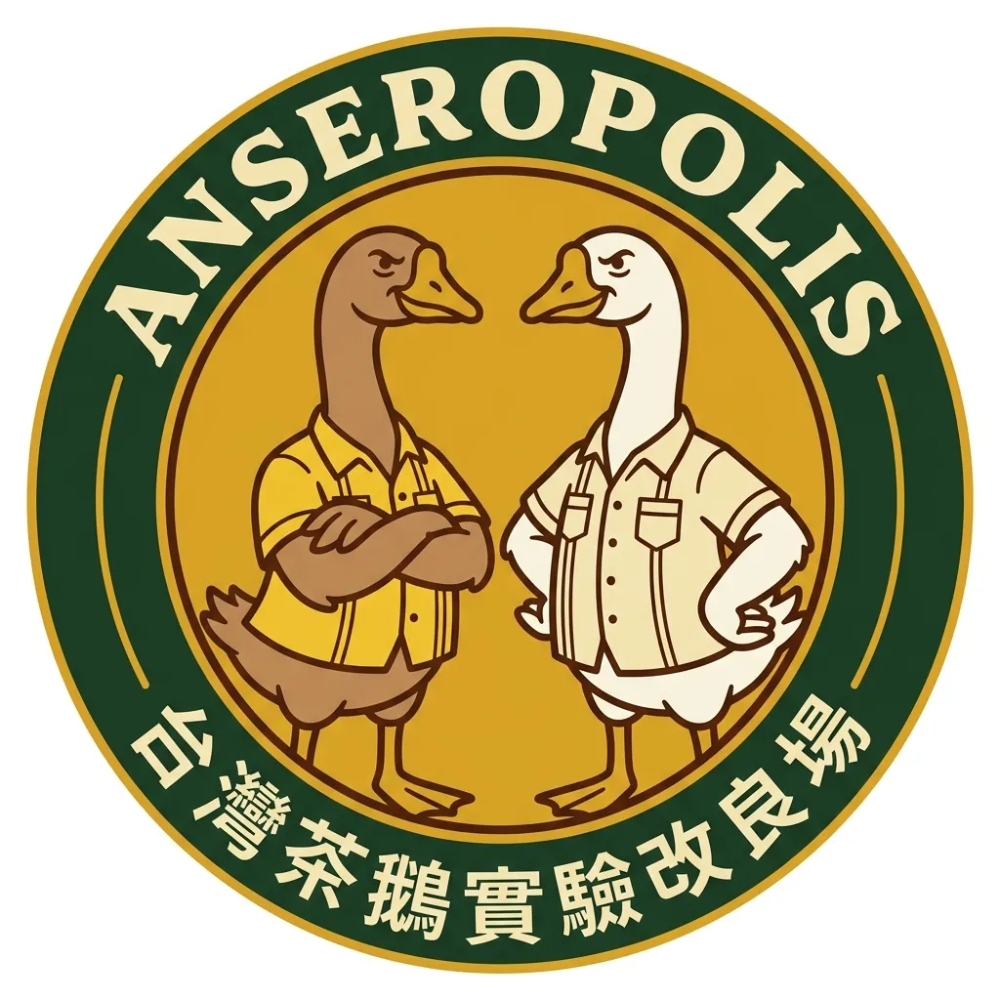

<p align="center">
  
</p>

# Anseropolis 🪿

> 台灣茶鵝實驗改良場 — Taiwan Tea Goose Experiment & Improvement Station

語言指紋偵測 × 可疑度評分 = 識別語言操控的工具。

---

## 快速開始

```bash
git clone https://github.com/FakeRocket543/anseropolis.git
cd anseropolis
python3 setup.py
```

安裝完成後，在目錄裡打開 AI Agent（OpenCode / Kiro CLI / Claude Code），貼一段你想分析的內容，agent 會自動引導完成分析。

---

## 為什麼做這個？

現有事實查核機制存在結構性限制：人力有限、選題覆蓋不均、對灰色地帶（如認知作戰、模糊承諾）的處理能力不足。

**Anseropolis 提供一套開源的語言分析工具，讓任何人都能獨立檢視文本的語言模式。**

---

## 架構

```
輸入文字
  ↓
ingest — CKIP 斷詞 + 實體提取 + 語言指紋 + embedding
  ↓
match — cosine kNN 比對已知語料庫（12+ 來源）
  ↓
decompose — LLM 聲明拆解
  ↓
retrieve — 搜尋引擎 + 證據評估
  ↓
score — 可疑詞典 + TAO 敘事詞 + 指紋加權評分
  ↓
package — 分析報告 + 圖卡產出
```

兩種執行模式：
- **Pipeline 模式**（`python3 -m src.run`）— 固定流程，可預測，適合批次
- **Agent 模式**（`python3 -m src.interactive`）— LLM 自主決策，適合深度分析

也可透過 **MCP Server**（`src/mcp_server.py`）或 **HTTP API**（`src/serve.py`）整合到其他工具。

## 語料庫

已建立 12+ 來源的語言指紋資料庫，涵蓋不同政治光譜：

| 來源 | 類型 |
|------|------|
| 國台辦 | 官方統戰文本 |
| 環球時報、中評社、人民日報 | 中國大陸官媒 |
| 自由時報、新頭殼 | 台灣綠營媒體 |
| 聯合報、中時、旺報 | 台灣藍營媒體 |
| ETtoday、上報、匯流新聞、風傳媒 | 台灣中間/綜合媒體 |
| 大紀元 | 海外中文媒體 |

每個來源獨立建模語言指紋，用於比對輸入文本「像誰在說話」。

## 跨語料庫分析

使用 BERTopic + Qwen3-VL-2B Embedding 進行跨來源主題模型分析，識別不同媒體在相同議題上的語言差異模式。詳見 `cross_topic/REPORT.md`。

## 與 Collatro 的差異

| | Collatro | Anseropolis |
|---|---|---|
| 目標 | 查核事實聲明 | 偵測語言操控模式 |
| 適合 | 謠言、假新聞、數字錯誤 | 認知作戰、帶風向、統戰文本 |
| 方法 | 拆解 → 搜尋 → 比對 | 語言指紋 + 可疑詞典 + 來源比對 |
| 輸出 | 對/錯/不足 | 可疑度分數 + 敘事框架 |
| 判斷 | 有明確對錯 | 沒有對錯，只有「像誰」 |

## 特色

- **語言指紋** — 不靠 LLM 判斷，靠詞彙分布模式識別來源
- **TAO 敘事庫** — 國台辦常用敘事框架的詞典比對
- **可疑度評分** — 語言指紋加權 40 分 > LLM 反駁率 15 分（Nature Comms 2025 實證支撐）
- **Wikidata KG** — 結構化事實驗證人物身份
- **圖卡輸出** — 自動生成視覺化分析圖卡
- **全本地運行** — 零雲端 API，所有模型本地推論
- **不下結論** — 可疑度高 ≠ 假的，只代表語言模式異常

## 學術基礎

- Ma et al. (2025) *Linguistic features of AI mis/disinformation and the detection limits of LLMs*, Nature Communications
- Wang et al. (2026) *Prompt-Induced Linguistic Fingerprints for LLM-Generated Fake News Detection*, WWW 2026
- Sousa-Silva (2022) *Fighting the Fake: A Forensic Linguistic Analysis*, Int J Semiot Law

## 系統需求

- macOS（Apple Silicon）或 Linux
- Python 3.10+
- ~16 GB RAM（所有模型同時載入）
- AI Agent（OpenCode / Kiro CLI / Claude Code）

## 文件

- [使用指南](doc/GUIDE.md)
- [技術架構](doc/ARCHITECTURE.md)
- [Pipeline 設計](doc/pipeline-design.md)
- [操作手冊](doc/MANUAL.md)

## 授權

MIT
