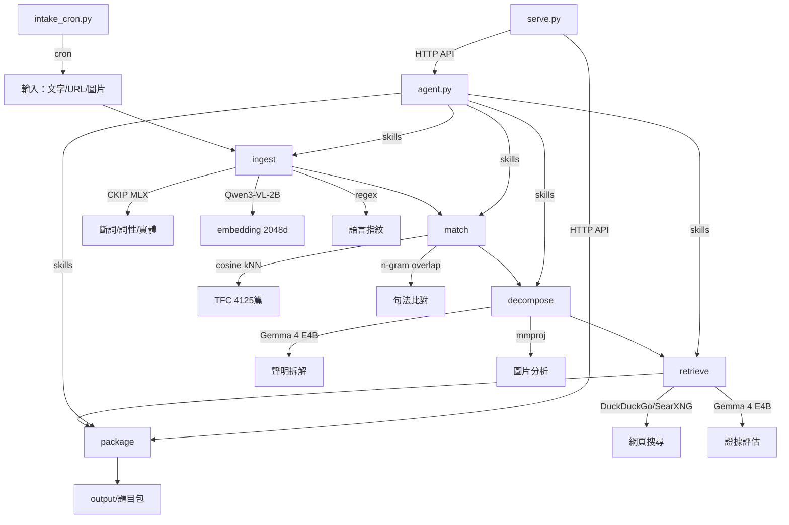
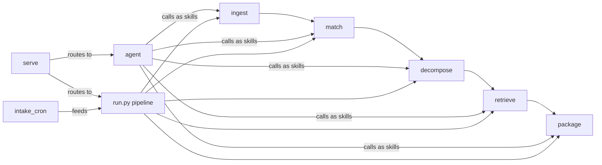

# 鵝改場技術架構

---

## 系統總覽



## 模組依賴圖



## 資料流

```
文字 ──→ ingest.json ──→ match.json ──→ claims.json ──→ evidence.json ──→ package.json
  │                                                                          │
  │  {text, ws, pos,    {matches: [{     {claims: [{      {claims: [{       {title, claims,
  │   fingerprint,       report_id,       text,             text,             evidence,
  │   keywords,          similarity,      difficulty}]}     evidence: [{      gaps, metadata}
  │   embedding}         title, url,                        url, snippet}],
  │                      match_type}]}                      assessment}]}
  │
  └──→ embedding (2048d) ──→ cosine similarity vs 4125 report vectors
```

## 模型依賴

| 模型 | 大小 | 用途 | 載入時機 |
|------|------|------|---------|
| CKIP ws (MLX) | ~400 MB | 中文斷詞 | ingest 首次呼叫 |
| CKIP pos (MLX) | ~400 MB | 詞性標記 | ingest 首次呼叫 |
| Qwen3-VL-Embedding-2B | 4.0 GB | 文字/圖片 embedding | ingest 首次呼叫 |
| Gemma 4 E4B Q8 | 7.5 GB | 聲明拆解 + 證據評估 | llama-server 常駐 |
| Gemma 4 E4B mmproj | 944 MB | 圖片視覺編碼 | llama-server 常駐 |

記憶體需求：~16 GB（所有模型同時載入）。Apple Silicon M1 16GB 可跑。

## 靜態資料

| 檔案 | 大小 | 內容 |
|------|------|------|
| public_index.json | 3.2 MB | 4125 篇 TFC 報告 metadata（無原文） |
| report_embeddings.npz | 27.6 MB | 4125 × 2048 報告級 embedding |
| watchlist.json | <1 KB | 定時爬蟲監控清單 |

## 檔案結構

```
anseropolis/
├── README.md
├── data/
│   ├── DATA_NOTICE.md            # 資料來源聲明
│   ├── public_index.json         # TFC metadata（標題/URL/verdict）
│   ├── report_embeddings.npz     # TFC embedding
│   └── watchlist.json            # 爬蟲監控清單
├── doc/
│   ├── GUIDE.md                  # 使用指南（本文件的姊妹篇）
│   ├── ARCHITECTURE.md           # 本文件
│   ├── requirement.md            # 需求書
│   ├── pipeline-design.md        # Pipeline 設計
│   ├── tea-goose-skill.md        # 教學用 skill 檔
│   └── logo.png
├── src/
│   ├── __init__.py
│   ├── ingest.py                 # 入料：CKIP + embedding + fingerprint
│   ├── match.py                  # 比對：kNN 謠言庫
│   ├── decompose.py              # 拆解：LLM 聲明提取（含視覺）
│   ├── retrieve.py               # 檢索：搜尋 + 證據評估
│   ├── package.py                # 打包：題目包 JSON + MD
│   ├── run.py                    # CLI：Pipeline 模式
│   ├── agent.py                  # CLI：Agent 模式（LLM 自主決策）
│   ├── serve.py                  # HTTP API server
│   └── intake_cron.py            # 定時爬蟲
├── tests/
│   ├── fixtures.json             # 10 則測試謠言
│   ├── run_all.py                # 批次測試
│   ├── e2e_results.md            # 測試報告
│   └── e2e_results.json
├── output/                       # 題目包產出
└── icons/                        # → ../icons/（logo）
```

## 兩種執行模式

### Pipeline 模式

固定流程，可預測，適合批次。

```
ingest → match → decompose → retrieve → package
  每步固定，JSON 傳遞，~24 秒/則
```

### Agent 模式

LLM 自主決策，靈活，適合深度查核。

```
Agent 拿到工具包（6 個 skills）
  → 自己決定用哪個、什麼順序
  → 可以跳步、重複、深入
  → ~30-60 秒/則
```

兩者共用同一組模組，差別只在誰決定流程：Pipeline 是你寫死的，Agent 是 LLM 決定的。

## 外部介面

| 介面 | 端口 | 用途 |
|------|------|------|
| llama-server | 8080 | LLM 推論（OpenAI 相容 API） |
| anseropolis serve | 9000 | 對外 API（查核 + 題目包） |
| SearXNG（選配） | 8888 | 自架搜尋引擎 |

## 成本

零。全部本地跑，無雲端 API。
